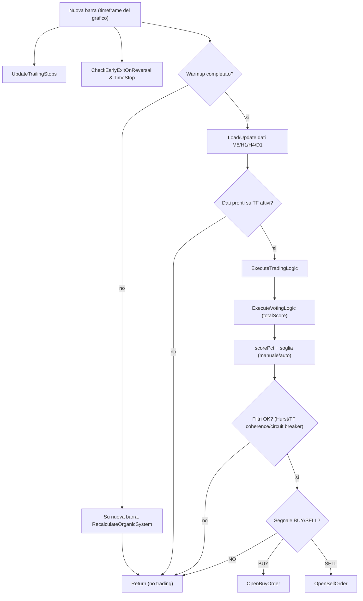

# Organic Jarvis v1.1 - Documentazione ultra-dettagliata (EA MT5)

Questa guida spiega in modo molto semplice e molto preciso cosa fa l'EA `EA_ORGANIC_Jarvis_v1.1.mq5`, come prende decisioni, e come usa i suoi buffer (memorie circolari) per calcolare soglie e filtri in modo "data-driven".

> Nota importante: questa guida descrive il comportamento "logico" del codice. In MT5 ci sono sempre vincoli esterni (spread, quote, permessi trading, mercato chiuso, dati mancanti) che possono bloccare o ritardare operazioni.

## Come leggere le formule (LaTeX)

In questa guida uso formule in formato LaTeX, come nel Jarvis paper (ma qui sono applicate alla logica specifica della v1.1).

- Variabili tipo $H$, $scorePct$ sono numeri reali.
- Se vedi $N$, di solito e' la dimensione di un buffer o il numero di campioni.
- Tutti i calcoli "percentuale" sono in 0..100, non 0..1.

Unita di misura fondamentali:

- **point**: la minima unita di prezzo del simbolo (MT5: `SYMBOL_POINT` o `_Point`).
- **pip**: spesso (ma non sempre) vale $10$ points su simboli a 5 cifre. L'EA lavora in **points** per SL/TP/Trailing.

Chiarimento importante sulle "scale" (ci sono 2 concetti diversi):

1) **Scala di prezzo (fisica)**: dipende dal simbolo e vale `point = SYMBOL_POINT`.
  - Questa scala si usa per SL/TP/Trailing, spread, slippage, ecc.
2) **Scala organica (data-driven, dimensionless)**: deriva da Hurst e vale $scale(H)=2^{H}$.
  - Questa scala NON e' una scala di prezzo: e' un fattore senza unita.
  - Si usa per ampliare/ridurre finestre e pesi in modo adattivo (es. barre da caricare, pesi mean-reversion, intervalli di log/ricarica, soglie ridotte, ecc.).

---

## 1) Idea generale: cosa prova a fare l'EA

L'EA prova a:

1. **Leggere il mercato su piu timeframe** (M5, H1, H4, D1).
2. **Trasformare indicatori e segnali** in uno **score numerico** (positivo = idea BUY, negativo = idea SELL).
3. **Normalizzare** quello score in una percentuale: quanto e' forte il segnale rispetto al massimo possibile.
4. **Decidere** se aprire un trade usando:
   - una **soglia** (manuale o automatica),
   - e un filtro di regime basato su **Hurst** (per evitare di tradare quando il mercato sembra "rumore").
5. **Gestire le posizioni** aperte con:
   - trailing stop,
   - stop loss temporale,
   - uscita anticipata se arriva un reversal forte.
6. **Registrare statistiche** e, se richiesto, esportare dati (CSV) a fine test.

---

## 2) Glossario minimo (parole che ricorrono)

- **TF / Timeframe**: M5 = 5 minuti, H1 = 1 ora, H4 = 4 ore, D1 = 1 giorno.
- **Bid / Ask**: prezzi di vendita/acquisto. Lo spread e' `Ask - Bid`.
- **Point / _Point / SYMBOL_POINT**: unita' minima di prezzo del simbolo.
  - Attenzione: i "pips" non sono sempre 1 point; su simboli a 5 cifre, spesso 1 pip = 10 points.
- **Score**: numero che riassume quanti segnali puntano su BUY o SELL.
- **scorePct**: percentuale (sempre >= 0) che indica la forza del segnale.
- **Soglia (threshold)**: percentuale minima di scorePct richiesta per entrare.
- **Hurst (H)**: indicatore che prova a descrivere il regime:
  - H alto (es. > 0.55 circa): mercato piu "trend".
  - H basso (es. < 0.45 circa): mercato piu "mean-reverting".
  - H vicino al centro storico: mercato "random/noise".
- **Buffer**: memoria storica, spesso implementata come **ring buffer** (circolare) per mantenere ultimi N valori.

---

## 3) Architettura: 3 livelli (dati -> score -> trade)

### 3.0 Schema visivo (panoramica)



### Livello A: dati e indicatori (per ogni TF)

Per ogni TF l'EA mantiene una struttura con:

- prezzi (rates),
- serie indicatori (EMA, RSI, MACD, Bollinger, ATR, ADX, Heikin-Ashi, OBV, PSAR, SMA, Ichimoku, Stochastic, ecc.),
- statistiche derivate (medie, deviazioni standard, soglie organiche come `adx_threshold`, centri empirici tipo `rsi_center`),
- parametri "organici" (naturalPeriod, weight, min_bars_required, ecc.).

### Livello B: score multi-timeframe

- Per ogni TF attivo l'EA calcola uno **score normalizzato**.
- Somma gli score dei TF attivi.
- Applica anche un contributo mean-reversion combinato (RSI divergence + OBV divergence + Stoch extreme).

Risultato: `totalScore` (positivo o negativo).

### Livello C: decisione e gestione trade

- Trasforma `totalScore` in `scorePct` (forza %).
- Confronta `scorePct` con una soglia (manuale o auto).
- Applica filtri:
  - Hurst in **hard mode** puo' bloccare nuovi trade in no-trade zone;
  - Hurst in **soft mode (Option 1)** non blocca ma aumenta la soglia effettiva;
  - TF coherence (opzionale) puo' essere penalty (soft) o hard-block;
  - circuit breaker (opzionale) blocca solo i nuovi ingressi.
- Se entra:
  - apre BUY o SELL con SL/TP (prezzo fisso o points).
- Se e' in trade:
  - trailing stop,
  - time stop,
  - early exit su reversal contrario forte.

---

## 3.1 Le 3 formule chiave (score, percentuale, decisione)

### 3.1.1 Score totale (somma di contributi)

Concettualmente, l'EA costruisce uno score totale come somma degli score dei timeframe attivi piu un contributo mean-reversion:

$$
totalScore = \sum_{tf \in \{M5,H1,H4,D1\},\ tf\ attivo} score_{tf} + meanRevScore
$$

Dove $score_{tf}$ viene da `CalculateSignalScore(tfData, label)`.

### 3.1.2 Percentuale di forza del segnale (scorePct)

Per rendere confrontabile lo score quando cambi numero di indicatori e/o timeframe, l'EA calcola un massimo teorico e lo trasforma in percentuale:

$$
scorePct = \begin{cases}
\frac{|totalScore|}{maxScorePossible} \cdot 100 & \text{se } maxScorePossible > 0 \\
0 & \text{altrimenti}
\end{cases}
$$

### 3.1.3 Regola base di decisione

Sia $T_{base}$ la soglia corrente (manuale o automatica: warmup/otsu/youden).

Nella v1.1 aggiornata, l'EA puo' applicare filtri **soft** (es. Soft Hurst / TF coherence) che non bloccano direttamente ma aumentano la soglia, ottenendo una soglia effettiva $T_{eff}$:

$$
T_{eff} = \min\left(100,\ T_{base}\cdot m_{hurst}\cdot m_{tf}\right)
$$

Allora la regola di decisione diventa:

$$
decision =
\begin{cases}
BUY & \text{se } totalScore > 0 \text{ e } scorePct \ge T_{eff} \\
SELL & \text{se } totalScore < 0 \text{ e } scorePct \ge T_{eff} \\
NO\ TRADE & \text{altrimenti}
\end{cases}
$$

---

## 4) Ciclo di vita MT5: OnInit, OnTick, OnDeinit, OnTradeTransaction

### 4.1 OnInit(): preparazione

Obiettivo: mettere l'EA in condizione di lavorare senza prendere decisioni "cieche".

Passi tipici (in breve):

1. **Inizializza dimensioni buffer** e variabili globali.
2. **Calcola parametri organici** (natural period, scale/decay, pesi TF).
3. **Inizializza i buffer storici** (score, Hurst, tradeScore) e prova a **pre-caricarli** dallo storico.
4. **Crea handle indicatori** (EMA/RSI/MACD/BB/ATR/ADX...) per i vari TF.
5. Imposta flag di prontezza (readiness) e log diagnostici.

Punto chiave: l'EA cerca di evitare di partire senza abbastanza storia.

### 4.2 OnTick(): cuore operativo (ma lavora a "nuova barra")

Ogni tick l'EA:

1. Aggiorna trailing stop (gestione posizioni).
2. Controlla exit anticipato su reversal.
3. Controlla time stop.
4. Se e' ancora in warmup (buffer non pronti), prova a far avanzare il sistema e poi esce.
5. Quando arriva una **nuova barra** sul timeframe del grafico:
   - opzionalmente ricalcola l'intero sistema organico ogni N barre (`RecalcEveryBars`).
   - carica/aggiorna i dati multi-timeframe (cache + reload).
   - verifica `isDataReady` per i TF attivi.
   - esegue `ExecuteTradingLogic()`.

Importante: la decisione di trading avviene tipicamente **una volta per barra**, non per ogni tick.

Schema (molto vicino al codice):

```
OnTick()
  UpdateTrailingStops()
  CheckEarlyExitOnReversal()
  CheckAndCloseOnTimeStop()
  if warmup non completato:
     se buffer pronti: warmupComplete=true
     altrimenti: su nuova barra -> RecalculateOrganicSystem(); return
  se non e' nuova barra: return
  shouldRecalc? (RecalcEveryBars)
  se shouldRecalc: RecalculateOrganicSystem()
  carica/aggiorna dati TF (cache o reload)
  se M5 non disponibile: return
  imposta TF attivi
  se dati non pronti sui TF attivi: return
  ExecuteTradingLogic()
```

### 4.3 OnTradeTransaction(): traccia chiusure e aggiorna statistiche

Questa callback viene chiamata da MT5 quando succede qualcosa nella trade history.

L'EA la usa per:

- intercettare **solo** i deal di **chiusura** (DEAL_ENTRY_OUT),
- filtrare per **magic number** e simbolo,
- calcolare profitto netto (profit + commission + swap),
- calcolare durata del trade,
- aggiornare statistiche cumulative (win rate, PF, expectancy, drawdown, streak),
- salvare il trade in un buffer dei trade recenti,
- collegare `Score@Entry` al risultato (utile per soglia tipo Youden).

Nota (v1.1 aggiornato): se e' attivo l'**export esteso** (`ExportExtendedTradesCSV=true`), l'EA registra anche un **entry snapshot** al momento dell'apertura (score%, soglie, Hurst/TF coherence, spread/slippage, regime). Alla chiusura, `OnTradeTransaction()` recupera lo snapshot e crea un record esteso.

Gestione partial close (importante): lo snapshot resta associato alla **POSITION_IDENTIFIER** finche' la posizione non e' davvero chiusa. In caso di chiusure parziali (piu deal di uscita sullo stesso identifier), l'EA evita di “consumare” lo snapshot troppo presto.

### 4.4 OnDeinit(): pulizia ed export

Quando l'EA viene rimosso o finisce un backtest:

- pulisce risorse,
- se abilitato, esporta i trade in CSV.

In v1.1 ci sono **due export** separati:

- **Export legacy (Monte Carlo)**: `ExportTradesCSV=true` -> crea `trades_<symbol>_<date>_(backtest|live).csv` con colonne compatibili con lo script Python.
- **Export esteso (debug/diagnostica)**: `ExportExtendedTradesCSV=true` -> crea `trades_ext_<symbol>_<date>_(backtest|live).csv` con snapshot di ingresso + dati di chiusura.

Percorso: l'EA prova a scrivere in `FILE_COMMON` (cartella Common di MT5, accessibile sia in live che nel tester). Se non riesce, fa fallback su `MQL5\Files` del terminale.

Nel CSV esteso trovi (oltre ai campi classici) colonne specifiche per capire *perche'* un trade e' entrato/uscito, ad esempio:

- `ScorePctAtEntry`, `ThresholdBasePct`, `ThresholdEffPct`, `ThresholdMethodId/ThresholdMethod`
- `HurstSoftMult`, `HurstTradeScore`, `HurstTradeThreshold`, `HurstReady`, `HurstAllowTrade`
- `TFCoherenceMult`, `TFCoherenceConflicts/Supports`, `TFCoherenceBlocked`

---

## 5) Warmup: perche' l'EA "aspetta"

L'EA non vuole tradare prima di avere dati sufficienti.

In `OnTick()` esiste un blocco warmup che:

- controlla se:
  - buffer Hurst ha abbastanza campioni,
  - buffer tradeScore ha abbastanza campioni,
  - flag `g_hurstReady` e' true (se Hurst filter attivo).

Se non e' pronto:

- non fa trading,
- ogni nuova barra forza un `RecalculateOrganicSystem()` per far crescere i buffer,
- stampa log periodici per evitare "silenzio".

Nota: se `EnableHurstFilter=false`, molte condizioni warmup su Hurst vengono bypassate.

---

## 6) Caricamento dati multi-timeframe (cache + reload)

### 6.1 Concetto

Caricare tutte le barre per tutti i TF ad ogni barra sarebbe pesante.
Per questo:

- c'e' una cache (`tfDataCacheValid` e contatore),
- ogni tanto fa un reload completo (LoadTimeFrameData),
- altrimenti aggiorna solo l'ultima barra (UpdateLastBar).

Se l'update della cache fallisce, forza un reload completo per recuperare.

### 6.2 Quante barre carica

L'EA calcola `barsToLoad` cosi:

1. prende il massimo dei `min_bars_required` tra M5/H1/H4/D1,
2. lo moltiplica per una scala organica `GetOrganicScale(H)`,
3. garantisce un minimo (es. buffer XLarge),
4. limita a quante barre sono disponibili, con un margine di sicurezza,
5. garantisce almeno ~100 barre se disponibili.

Questo spiega perche' a volte vedi numeri simili tra TF: ci sono minimi, scalature e limiti di sicurezza.

---

## 7) Sistema "organico": natural period, scale, decay, pesi

Questa e' la parte "data-driven": invece di usare parametri fissi, l'EA prova a derivare molte finestre dai dati.

### 7.1 Natural period

Idea: trovare una lunghezza tipica del ciclo (o autocorrelazione) nel TF.

Da li':

- decide quante barre servono per stimare indicatori e statistiche,
- definisce la base per tempi di log, ricalcoli, finestre.

### 7.2 Scale e Decay da Hurst

L'EA deriva moltissimi "fattori" da $H$ usando potenze di 2 (coerente con la documentazione storica di Organic Jarvis):

$$
scale(H) = 2^{H}
$$

$$
decay(H) = 2^{-H}
$$

E quando serve un decadimento piu aggressivo:

$$
decayPow(H, k) = 2^{-kH}
$$

#### 7.2.1 Dove viene usata la scala organica nella v1.1 (esempi concreti)

Nel codice v1.1 la scala organica $scale(H)$ (e il suo duale $decay(H)$) viene usata come moltiplicatore per rendere adattivi diversi pezzi. Alcuni esempi che vedi direttamente nel flusso:

- **Numero barre da caricare**: $barsToLoad \approx maxPeriodNeeded \cdot scale(H)$ (poi con minimi/limiti di sicurezza).
- **Mean-reversion weights**: nella combinazione, RSI pesa con $scale(H)$; Stoch pesa con $decay(H)$.
- **Soglia ridotta per entry anticipato**: $reversalThreshold = T_{eff} \cdot decay(H)$ (dove $T_{eff}$ include eventuali penalita' Soft Hurst / TF coherence).
- **Zona random Hurst**: margine proporzionale a $stdev(H)\cdot decay(H)$.

Idea semplice: $scale(H)$ tende ad "allargare" quando il regime e' piu persistente, mentre $decay(H)$ tende a "smorzare" (ridurre peso/soglia) in modo controllato.

Interpretazione semplice:

- se H suggerisce trend, alcune cose diventano "piu larghe" o pesate diversamente,
- se H suggerisce mean-reversion, alcune cose diventano "piu conservative".

### 7.3 Pesi dei timeframe

Ogni TF ha un peso `tfData_X.organic.weight`.

Concetto:

- un TF puo' contare piu di un altro,
- lo score finale e' una somma pesata.

Forma concettuale tipica (utile per capirsi, anche se l'implementazione puo avere ottimizzazioni):

$$
weight_{tf} = \frac{H_{tf}}{\sum H_{tf}}
$$

Idea: se un timeframe ha $H$ piu alto (piu "trend"), il suo voto e' considerato piu affidabile e pesa di piu.

### 7.4 Come viene calcolato H (idea R/S, formula LaTeX)

Nel codice la stima di H segue l'idea classica R/S (Rescaled Range). Qui la descrivo in modo concettuale (per capire cosa significa H, non per ricostruire ogni dettaglio numerico).

Dato un vettore di rendimenti (o differenze) $x_1, x_2, ..., x_n$:

1) Media:

$$
\bar{x} = \frac{1}{n}\sum_{t=1}^{n} x_t
$$

2) Deviazioni cumulative:

$$
Y_k = \sum_{t=1}^{k} (x_t - \bar{x})
$$

3) Range cumulativo:

$$
R(n) = \max_{1\le k\le n} Y_k - \min_{1\le k\le n} Y_k
$$

4) Deviazione standard:

$$
S(n) = \sqrt{\frac{1}{n}\sum_{t=1}^{n} (x_t - \bar{x})^2}
$$

5) Rapporto riscalato:

$$
\frac{R(n)}{S(n)}
$$

L'idea e' che, per molti processi, vale approssimativamente:

$$
\mathbb{E}[R(n)/S(n)] \propto n^{H}
$$

Quindi stimare $H$ equivale (in pratica) a lavorare in logaritmi:

$$
\log(R/S) \approx H\log(n) + c
$$

Interpretazione rapida:

- $H>center$ suggerisce persistenza (trend)
- $H<center$ suggerisce anti-persistenza (reversion)
- $H$ vicino al centro storico suggerisce "random/noise"

---

## 8) Filtro Hurst: no-trade zone (mercato "random")

### 8.1 Che problema risolve

Quando il mercato e' molto "rumoroso", tanti indicatori danno segnali casuali.

L'EA usa Hurst per dire:

- se H e' vicino al suo centro storico (zona random), il mercato e' spesso "noise":
  - in **modalita' hard** puo' bloccare i nuovi ingressi,
  - in **modalita' soft (Option 1)** non blocca, ma rende l'ingresso piu difficile aumentando la soglia effettiva.

### 8.2 Come decide se bloccare

In pratica usa:

- una stima del centro storico `g_hurstCenter`,
- una deviazione standard `g_hurstStdev`,
- una soglia (tradeScoreThreshold) e un tradeScore che misura quanto H si discosta.

Output logico (in base alla configurazione):

- **Hard gate** (storico): `IsTradeAllowedByHurst()` decide se puoi aprire nuovi trade.
- **Soft gate (Option 1)**: `IsTradeAllowedByHurst()` non hard-blocca; invece viene calcolato un moltiplicatore `HurstSoftMult >= 1` che aumenta la soglia di ingresso.

Formule (concetto, coerente con variabili globali come `g_hurstCenter`, `g_hurstStdev`, `g_hurstRandomLow`, `g_hurstRandomHigh`):

1) L'EA mantiene uno storico recente dei valori di Hurst e calcola:

$$
center = mean(H_{history})
$$

$$
stdev = std(H_{history})
$$

2) Definisce la zona random adattiva usando un margine che dipende da $decay(H)$:

$$
randomLow = center - stdev \cdot decay(H)
$$

$$
randomHigh = center + stdev \cdot decay(H)
$$

3) Se l'Hurst corrente sta dentro $[randomLow, randomHigh]$, l'EA considera il mercato "troppo rumoroso" e blocca i nuovi ingressi.

Nota importante: la frase sopra e' vera come intuizione, ma **in v1.1** la decisione di blocco e' implementata in modo piu robusto: costruisce i bounds e poi usa un **tradeScore** (distanza normalizzata) confrontato con una **soglia dinamica**. Vedi 8.3.

### 8.3 Come identifica la no-trade zone in v1.1 (due passaggi reali)

La v1.1 fa due cose distinte:

1) costruisce una zona random data-driven (bounds)
2) decide il blocco con tradeScore >= soglia (gate)

#### Passo 1: bounds randomLow/randomHigh dai dati

L'EA mantiene un ring buffer di Hurst composito e calcola centro e deviazione standard.

Concettualmente:

$$
center = mean(H_{history})
$$

$$
stdev = std(H_{history})
$$

Margine (nel codice: usa $decay(center)$):

$$
margin = stdev\cdot decay(center)
$$

Bounds:

$$
randomLow = center - margin
$$

$$
randomHigh = center + margin
$$

#### Passo 2: tradeScore (distanza normalizzata) e soglia dinamica

La decisione finale non e' solo "H dentro bounds". L'EA misura quanto H si discosta dal centro e lo normalizza.

Mini-glossario (cosa significa ogni pezzo e a cosa serve):

- `center`: la media storica di H (il "punto 0" della tua statistica). Serve come riferimento per dire "sono vicino alla normalita' o mi sto spostando?".
- `stdev`: deviazione standard storica di H. Serve per capire quanta variabilita' e' normale. Se `stdev` e' grande, H oscilla tanto e devi essere piu cauto a interpretare un singolo valore.
- `margin`: ampiezza della zona random attorno a `center`. Serve per costruire una banda che cresce/decresce con la volatilita' statistica di H.
- `randomLow/randomHigh`: bounds della zona random. Servono come descrizione del regime "rumore" (ma in v1.1 non sono l'unico gate).
- `deviation`: distanza assoluta dal centro. Serve come misura semplice: "quanto mi sono allontanato?".
- `normFactor = stdev * scale(H)`: normalizzatore. Serve per trasformare una distanza in un numero confrontabile nel tempo (se stdev cambia, non vuoi che la soglia diventi incoerente).
- `confidence` (0..1): coefficiente di confidenza. Serve a ridurre l'impatto quando sei vicino al centro e aumentarlo quando ti stai staccando in modo piu chiaro.
- `tradeScore`: quanto e' "significativo" lo stacco dal centro, dopo normalizzazione. E' il numero che la v1.1 confronta con la soglia.
- `threshold`: soglia dinamica costruita dai tradeScore recenti. Serve per adattarsi ai cambiamenti del mercato senza fissare numeri "a mano".
- `allowTrade`: gate finale. Se false, l'EA blocca nuovi ingressi (ma continua gestione posizioni).

Definizioni coerenti con la logica del codice:

- $deviation = |H_{composite} - center|$
- $confidence \in [0,1]$ (aumenta con la distanza dal centro)
- $normFactor = stdev \cdot scale(H)$ (se valido)

Punteggio:

$$
tradeScore = \frac{deviation\cdot confidence}{normFactor}
$$

Poi l'EA mantiene un secondo ring buffer di tradeScore e costruisce una soglia dinamica (media + stdev * decay(H), con limiti min/max):

$$
threshold \approx mean(tradeScore) + std(tradeScore)\cdot decay(H)
$$

Gate finale:

$$
allowTrade = (tradeScore \ge threshold)
$$

Interpretazione operativa (hard gate):

- se sei troppo vicino a center, deviation e tradeScore sono bassi -> spesso **non** superi la soglia -> **no-trade zone**
- se H si stacca in modo convincente dal centro -> tradeScore sale -> supera la soglia -> **trade permesso**

Interpretazione operativa (soft gate - Option 1):

- se `tradeScore` e' sotto soglia, invece di bloccare, l'EA applica una penalita' che aumenta la soglia effettiva:

$$
T_{eff} = \min\left(100,\ T_{base}\cdot HurstSoftMult\right)
$$

- `HurstSoftMult` cresce al crescere del "deficit" (quanto `tradeScore` e' sotto `threshold`) fino a un massimo (`HurstSoftMaxPenaltyPct`).
- se `tradeScore \ge threshold` (oppure Hurst non e' pronto), allora `HurstSoftMult = 1` (nessuna penalita').

Paragrafo chiave (no-trade zone, detta semplice):

La no-trade zone in v1.1 e' la situazione in cui **lo stacco di H dal suo centro storico non e' abbastanza "statisticamente rilevante"**. In pratica: sei vicino al centro rispetto alla variabilita' tipica (`stdev`) e al fattore organico (`scale(H)`), quindi il `tradeScore` resta sotto la `threshold`. Questo evita di entrare quando il regime sembra rumore e gli indicatori rischiano di "votare a caso".

### 8.4 Cosa succede se `EnableHurstFilter=false`

Se `EnableHurstFilter=false`, il filtro Hurst non viene usato come gate.
In pratica l'EA non blocca nuovi trade per no-trade zone (anche se H e' in regime random).

Inoltre, in questa configurazione la soglia effettiva non riceve penalita' da Hurst (equivalente a `HurstSoftMult = 1`).

### 8.5 Interazione con "entry anticipato" e altre penalita'

Quando l'EA usa soglie dinamiche o filtri soft (Soft Hurst e/o TF coherence), la regola pratica e':

- la soglia base $T_{base}$ e' quella manuale o automatica (Otsu/Youden),
- la soglia effettiva $T_{eff}$ include penalita' (moltiplicatori >= 1),
- l'entry anticipato usa la soglia ridotta calcolata dalla soglia effettiva:

$$
reversalThreshold = T_{eff} \cdot decay(H)
$$

Schema visivo (asse H):

```
H basso                 center                  H alto
|-------------------------|-----------------------|
  REVERT                 RANDOM                 TREND
            [randomLow ----- randomHigh]
            (NO TRADE ZONE)
```

---

## 9) Sistema voti (trend) + voto mean-reversion (contrarian)

### 9.1 Trend: indicatori che votano direzione

Per ogni TF attivo l'EA calcola `CalculateSignalScore(tfData, label)`.

Lo score tiene conto di gruppi:

- TREND PRIMARY (peso 1.0 ciascuno): EMA, MACD, PSAR, SMA, Ichimoku
- TREND SUPPORT (peso decay(H) ciascuno): Bollinger (middle), Heikin-Ashi
- TREND FILTER (peso 1.0, condizionale): ADX (vota solo se ADX > soglia organica)

Il risultato per TF e' uno score normalizzato (es. da -1 a +1 o simile) e poi pesato con `weight` del TF.

### 9.2 Mean-reversion: un voto combinato unico (v1.1)

L'EA crea un solo segnale contrarian combinando:

- RSI divergence
- OBV divergence
- Stochastic extreme

Pesi interni (semplice):

- RSI divergence pesa con $scale(H)$
- OBV divergence pesa con $1.0$
- Stoch pesa con $decay(H)$

Poi calcola una forza normalizzata `meanRevCombinedStrength`.

- Se la forza supera una soglia data-driven (`meanRevThreshold = decay(H)`), allora il segnale contrarian e' attivo (+1 o -1).
- Questo voto viene poi applicato a TUTTI i TF attivi, con peso `decay(H) * weight_TF`.

Dettaglio (modello matematico coerente con la struttura del codice):

- Ogni detector produce un segnale $s_i \in \{-1,0,+1\}$.
- Ogni detector ha anche una forza $str_i \in [0,1]$.
- I pesi sono $w_{rsi}=scale(H)$, $w_{obv}=1$, $w_{stoch}=decay(H)$.

Somma pesata:

$$
combinedScore = \sum_i s_i \cdot w_i \cdot str_i
$$

Normalizzazione:

$$
combinedMax = \sum_i w_i \cdot \mathbb{1}[s_i \ne 0]
$$

$$
meanRevCombinedStrength =
\begin{cases}
\frac{|combinedScore|}{combinedMax} & combinedMax>0 \\
0 & \text{altrimenti}
\end{cases}
$$

Soglia di attivazione:

$$
meanRevThreshold = decay(H)
$$

Importante: in v1.1 il mean-reversion non blocca; **aggiunge** al totalScore.

---

## 10) Da totalScore a scorePct (forza in percentuale)

### 10.1 Perche' serve

`totalScore` da solo non basta, perche' dipende da:

- quanti indicatori sono abilitati,
- quanti TF sono attivi,
- quali pesi organici ci sono.

Quindi l'EA calcola anche il massimo teorico `maxScorePossible`.

### 10.2 Come calcola maxScorePossible

L'EA somma:

- per ogni TF attivo: `weight_TF * totalIndicatorWeight`
- piu il massimo per il blocco mean-reversion (meanRevMaxScore)

Dove `totalIndicatorWeight` e' la somma dei pesi delle categorie (PRIMARY + SUPPORT + FILTER).

Dettaglio (coerente con `ExecuteVotingLogic()`):

- Trend Primary (peso 1.0 ciascuno): EMA, MACD, PSAR, SMA, Ichimoku
- Trend Support (peso $decay(H)$ ciascuno): BB, Heikin
- Trend Filter (peso 1.0 come categoria): ADX (ma il contributo effettivo e' condizionale)

In forma compatta:

$$
totalIndicatorWeight = w_{primary} + w_{support} + w_{filter}
$$

$$
maxScorePossible = \sum_{tf\ attivo} weight_{tf} \cdot totalIndicatorWeight + meanRevMaxScore
$$

### 10.3 Calcolo scorePct

Formula (LaTeX):

$$
scorePct = \begin{cases}
\frac{|totalScore|}{maxScorePossible}\cdot 100 & \text{se } maxScorePossible>0 \\
0 & \text{altrimenti}
\end{cases}
$$

Quindi:

- scorePct e' sempre >= 0
- 0 significa segnale nullo
- 100 significa segnale al massimo teorico.

---

## 11) Soglia di ingresso (manuale o automatica)

### 11.1 Modalita manuale

- `AutoScoreThreshold=false`
- usa direttamente `ScoreThreshold`.

### 11.2 Modalita automatica

- `AutoScoreThreshold=true`
- l'EA mantiene un buffer storico dei `scorePct` e prova a stimare una soglia automatica.

Nella v1.1 la soglia automatica segue una logica a due fasi (concetto):

1) **Warmup (Otsu)**: separa score "bassi" e "alti" massimizzando la separazione tra gruppi.
2) **Feedback (Youden)**: dopo abbastanza trade, ottimizza una metrica tipo Youden per distinguere trade buoni e cattivi.

Indice di Youden (alto livello):

$$
J = TPR + TNR - 1
$$

### 11.3 Otsu (dettaglio formula, alto livello)

Nel warmup, un criterio tipo Otsu prova a trovare una soglia $t$ che separa meglio "score bassi" e "score alti".

Definizione tipica (sui bin/istogramma), per una soglia candidata $t$:

- $\omega_0(t)$ = probabilita (peso) del gruppo sotto soglia
- $\omega_1(t)$ = probabilita (peso) del gruppo sopra soglia
- $\mu_0(t)$, $\mu_1(t)$ = medie dei due gruppi

Varianza tra-classi:

$$
\sigma_b^2(t) = \omega_0(t)\omega_1(t)\left(\mu_0(t)-\mu_1(t)\right)^2
$$

La soglia scelta e':

$$
t^* = \arg\max_t \sigma_b^2(t)
$$

Nota: nel codice reale ci sono dettagli pratici (binning, bounds, fallback, readiness) per garantire robustezza.

Quando la soglia automatica non e' pronta (pochi campioni):

- usa un fallback su `ScoreThreshold`.

---

## 12) Decisione finale: quando entra

L'EA produce una decisione:

- `decision = 1` -> BUY
- `decision = -1` -> SELL
- `decision = 0` -> NO TRADE

Regole base (soglia base vs soglia effettiva):

1. Calcola una soglia base $T_{base}$ (manuale o automatica: warmup/otsu/youden).
2. Calcola una soglia effettiva $T_{eff}$ applicando eventuali filtri **soft** (moltiplicatori che rendono l'ingresso piu difficile):

$$
T_{eff} = \min\left(100,\ T_{base}\cdot m_{hurst}\cdot m_{tf}\right)
$$

dove tipicamente $m_{hurst} = HurstSoftMult \ge 1$ e $m_{tf}\ge 1$ dipende dal filtro TF coherence.

3. Decisione:

- Se `totalScore > 0` e `scorePct >= T_eff` -> BUY
- Se `totalScore < 0` e `scorePct >= T_eff` -> SELL

Regola extra (entry anticipato):

- se non hai decisione,
- ma c'e' un reversal forte (strength >= `g_reversalThreshold`),
- e la direzione combacia,
- e `scorePct` supera una soglia ridotta: `reversalThreshold = soglia * decay(H)`,

allora entra lo stesso (reversalBoost).

Formula della soglia ridotta:

$$
reversalThreshold = T_{eff} \cdot decay(H)
$$

Dove $T$ e' la soglia corrente (manuale o automatica).

Nota: anche dopo la decisione, `ExecuteTradingLogic()` applica ulteriori filtri (permessi trading, spread, max posizioni, filtro Hurst hard se attivo, filtro TF coherence se configurato hard-block, e circuit breaker). Questi filtri possono bloccare l'apertura pur avendo una decisione BUY/SELL.

Logging (v1.1 aggiornato): ogni tentativo di ingresso produce una riga compatta `[DECISION]` con score, soglie (base/effettiva), moltiplicatori (Soft Hurst/TF coherence), e l'eventuale motivo di blocco (spread, max posizioni, permessi, circuit breaker, ecc.).

---

## 13) Apertura ordine: BUY e SELL

### 13.1 Validazione volume

Per BUY e SELL l'EA:

- legge min/max/step volume dal broker,
- clampa `LotSize` dentro i limiti,
- arrotonda allo step,
- fa `NormalizeDouble(..., 2)`.

Se dopo la normalizzazione il lotto scende sotto il minimo, non apre.

### 13.2 Prezzo, SL, TP

- BUY usa `Ask` come prezzo di riferimento.
- SELL usa `Bid`.

SL e TP:

- se e' impostato un prezzo fisso (StopLossPrice..., TakeProfitPrice...), usa quello.
- altrimenti usa distanza in **points**: `...Points * _Point`.

### 13.3 Slippage e registrazione Score@Entry

Dopo `trade.Buy()` / `trade.Sell()` l'EA:

- legge `trade.ResultPrice()`
- calcola slippage (in points)
- registra lo score di ingresso `g_lastEntryScore` legandolo a un `positionId`
  - usa `trade.ResultDeal()` come id principale, fallback su `ResultOrder()`.

Questo serve per collegare il trade chiuso al suo score di ingresso in `OnTradeTransaction`.

---

## 14) Gestione posizioni

### 14.1 Trailing stop (in points)

Concetto:

- dopo un profitto di `TrailingStartPoints`, l'EA sposta SL a distanza `TrailingStepPoints` dal prezzo.

Formule (coerenti con `UpdateTrailingStops()`):

Sia $p$ il point size (`SYMBOL_POINT`).

Nota: qui la scala e' quella di prezzo (points). Non c'entra $scale(H)$: il trailing e' geometria pura di prezzo.

Profitto in points:

$$
profitPoints_{BUY} = \frac{price_{bid} - openPrice}{p}
$$

$$
profitPoints_{SELL} = \frac{openPrice - price_{ask}}{p}
$$

Nuovo SL:

$$
newSL_{BUY} = price_{bid} - trailingStepPoints \cdot p
$$

$$
newSL_{SELL} = price_{ask} + trailingStepPoints \cdot p
$$

---

## Formulary (tutte le formule in un posto)

Questa sezione e' una "pagina di riferimento". Le formule sono le stesse spiegate nel testo, ma raccolte.

### Scale summary (le 3 scale usate)

| Nome | Simbolo | Unita | Serve per | Nota |
|---|---|---|---|---|
| Scala di prezzo | $p$ | point (price unit minima) | SL/TP/Trailing, spread, slippage | $p = SYMBOL_POINT = _Point$ |
| Scala organica (Hurst) | $scale(H)$, $decay(H)$ | dimensionless | pesi/finestre/soglie adattive | $scale(H)=2^H$, $decay(H)=2^{-H}$ |
| Scala percentuale | $scorePct$ | % (0..100) | confronto segnale vs soglia | non e' una probabilita' |

### A) Scale organiche da Hurst (dimensionless)

$$
scale(H) = 2^{H}
$$

$$
decay(H) = 2^{-H}
$$

$$
decayPow(H,k) = 2^{-kH}
$$

### B) Score totale e percentuale

$$
totalScore = \sum_{tf\ attivo} score_{tf} + meanRevScore
$$

$$
scorePct = \begin{cases}
\frac{|totalScore|}{maxScorePossible} \cdot 100 & maxScorePossible>0 \\
0 & \text{altrimenti}
\end{cases}
$$

Decisione base con soglia $T$:

$$
decision =
\begin{cases}
BUY & totalScore>0 \ \wedge\ scorePct\ge T \\
SELL & totalScore<0 \ \wedge\ scorePct\ge T \\
NO\ TRADE & \text{altrimenti}
\end{cases}
$$

Soglia ridotta per entry anticipato:

$$
reversalThreshold = T_{eff} \cdot decay(H)
$$

### B.1) Soglia effettiva (soft gating)

Quando alcuni filtri non vogliono hard-bloccare ma solo rendere l'ingresso piu selettivo, l'EA usa una soglia effettiva:

$$
T_{eff} = \min\left(100,\ T_{base}\cdot m_{hurst}\cdot m_{tf}\right)
$$

con $m_{hurst}\ge 1$ (Soft Hurst) e $m_{tf}\ge 1$ (TF coherence in modalita' penalty). Se un filtro e' disattivo o non applicabile, il suo moltiplicatore vale 1.

### C) Zona random Hurst (no-trade zone)

Ring buffer Hurst (n campioni):

$$
center = \frac{\sum H}{n}
$$

$$
stdev = \sqrt{\max\left(\frac{\sum H^2}{n} - center^2, 0\right)}
$$

Margine (v1.1 usa $decay(center)$):

$$
margin = stdev\cdot decay(center)
$$

$$
randomLow = center - margin
$$

$$
randomHigh = center + margin
$$

Decisione reale (v1.1: tradeScore + soglia):

$$
deviation = |H_{composite} - center|
$$

$$
normFactor = stdev\cdot scale(H)
$$

$$
tradeScore = \frac{deviation\cdot confidence}{normFactor}
$$

$$
threshold \approx mean(tradeScore) + std(tradeScore)\cdot decay(H)
$$

$$
allowTrade = (tradeScore \ge threshold)
$$

Nota: in **hard mode** `allowTrade=false` blocca direttamente nuovi ingressi. In **soft mode (Option 1)** `allowTrade` viene comunque calcolato e loggato, ma l'ingresso non viene bloccato: la differenza si riflette nel moltiplicatore `HurstSoftMult` e quindi in $T_{eff}$.

### D) Mean-reversion combinato (alto livello)

$$
combinedScore = \sum_i s_i \cdot w_i \cdot str_i
$$

$$
combinedMax = \sum_i w_i \cdot \mathbb{1}[s_i \ne 0]
$$

$$
meanRevCombinedStrength =
\begin{cases}
\frac{|combinedScore|}{combinedMax} & combinedMax>0 \\
0 & \text{altrimenti}
\end{cases}
$$

Soglia attivazione:

$$
meanRevThreshold = decay(H)
$$

### E) Rolling statistics per buffer (sum/sumsq)

Per $n$ campioni $x_i$ nel buffer:

$$
S=\sum x_i,\quad Q=\sum x_i^2
$$

$$
mean=\frac{S}{n}
$$

$$
variance=\frac{Q}{n}-mean^2
$$

$$
stdev=\sqrt{\max(variance,0)}
$$

Anti-drift (ricomputo completo):

$$
S := \sum_{i=1}^{n} x_i,\quad Q := \sum_{i=1}^{n} x_i^2
$$

### F) Otsu (warmup soglia, alto livello)

$$
\sigma_b^2(t) = \omega_0(t)\omega_1(t)\left(\mu_0(t)-\mu_1(t)\right)^2
$$

$$
t^* = \arg\max_t \sigma_b^2(t)
$$

### G) Youden (feedback trade, alto livello)

$$
J = TPR + TNR - 1
$$

### H) Trailing stop (scala di prezzo in points)

Sia $p = SYMBOL\_POINT$.

$$
profitPoints_{BUY} = \frac{price_{bid} - openPrice}{p}
$$

$$
profitPoints_{SELL} = \frac{openPrice - price_{ask}}{p}
$$

$$
newSL_{BUY} = price_{bid} - trailingStepPoints\cdot p
$$

$$
newSL_{SELL} = price_{ask} + trailingStepPoints\cdot p
$$

Dettagli:

- per BUY usa il Bid come currentPrice.
- per SELL usa l'Ask.
- aggiorna SL solo se e' un miglioramento:
  - BUY: nuovo SL deve essere piu alto del precedente.
  - SELL: nuovo SL deve essere piu basso del precedente.
- non mette SL oltre/breakeven nel verso sbagliato:
  - BUY: non mette SL <= openPrice
  - SELL: non mette SL >= openPrice

### 14.2 Early exit su reversal contrario

Se c'e' un reversal molto forte e una posizione e' in perdita:

- se la posizione e' BUY e reversal e' SELL -> chiude
- se la posizione e' SELL e reversal e' BUY -> chiude

Ma solo se la perdita in pips supera una soglia minima (evita rumore), basata su `GetOrganicDecayPow(H, 2) * 20`.

### 14.3 Time stop (stop loss temporale)

Se configurato `BuyTimeStopMinutes` o `SellTimeStopMinutes`:

- chiude posizioni che durano oltre il limite.
- prova a escludere il tempo di weekend dal conteggio (approssimazione).

---

## 15) Buffer: cosa sono e perche' sono fondamentali

Un buffer e' una memoria degli ultimi N valori.

Qui l'EA usa spesso ring buffer (circolari) per:

- non crescere all'infinito,
- avere statistiche rolling (media, varianza) aggiornate in O(1).

Schema tipico ring buffer:

- `array[]` (dimensione massima N)
- `size` (quanti elementi validi ci sono, 0..N)
- `index` (dove scrivere il prossimo valore, 0..N-1)

Quando aggiungi un valore:

1. se `size < N`, incrementi size
2. scrivi in `array[index]`
3. `index = (index + 1) % N`

Schema visivo ring buffer (semplice):

```
array (N=8):  [0][1][2][3][4][5][6][7]
                       ^
                     index (prossima scrittura)

Scrivi -> index avanza -> quando arriva a 7 torna a 0.
I valori vecchi vengono sovrascritti in modo controllato.
```

### 15.1 Statistiche rolling: media e deviazione standard (LaTeX)

Molti buffer tengono anche:

- $S = \sum x_i$ (somma)
- $Q = \sum x_i^2$ (somma dei quadrati)

Per $n$ campioni validi nel buffer:

$$
mean = \frac{S}{n}
$$

$$
variance = \frac{Q}{n} - mean^2
$$

$$
stdev = \sqrt{\max(variance, 0)}
$$

Questo spiega perche' nel codice vedi spesso `sum` e `sumSq`: permettono di aggiornare media/stdev velocemente senza scorrere sempre tutto l'array.

Spiegazione pratica (senza formule):

- **mean (media)**: dice dove sta il "centro" dei valori recenti. Se i valori si spostano, la media si sposta.
- **variance (varianza)**: misura quanto i valori sono dispersi attorno alla media (quanto "ballano").
- **stdev (deviazione standard)**: e' la radice della varianza. Ha la stessa scala dei dati originali (qui: stessa scala di H o di score, non percento). E' piu intuitiva per fare confronti.

Perche' c'e' `max(variance, 0)`:

- per effetti numerici (arrotondamenti floating point) puo' uscire una varianza leggermente negativa tipo `-1e-12`.
- quella cosa non ha significato fisico; quindi si clampa a 0 prima della radice.

---

## 16) Buffer Hurst (g_hurstHistory)

### 16.1 Scopo

Tenere uno storico recente dei valori di Hurst, per:

- calcolare centro/stdev,
- definire no-trade zone,
- calcolare tradeScore (quanto H e' lontano dal centro).

### 16.2 Struttura tipica

- `g_hurstHistory[]` ring buffer
- `g_hurstHistoryMax` (qui c'e' anche un massimo fisso `HURST_HISTORY_MAX`)
- `g_hurstHistorySize`
- `g_hurstHistoryIndex`
- `g_hurstSum`, `g_hurstSumSq` per media/varianza veloci
- contatore anti-drift per ricalcolo completo ogni tot inserimenti

### 16.3 Perche' sum e sumsq

Se vuoi media e varianza rolling:

- media = sum / n
- var = (sumsq / n) - media^2

Aggiornare sum e sumsq ad ogni nuovo valore e' molto veloce.

### 16.4 Anti-drift

Nel tempo, somme e floating point possono accumulare piccoli errori.

Soluzione pratica:

- ogni tanto l'EA ricalcola sum e sumsq scorrendo tutto il buffer (costo O(N), ma raro).

In formule: invece di fidarsi solo di $S$ e $Q$ aggiornati incrementando (che nel tempo possono accumulare piccoli errori numerici), ogni tanto ricomputi:

$$
S := \sum_{i=1}^{n} x_i
$$

$$
Q := \sum_{i=1}^{n} x_i^2
$$

---

## 17) Buffer TradeScore Hurst (g_tradeScoreHistory)

### 17.1 Scopo

Tenere uno storico del punteggio che misura quanto il regime Hurst e' favorevole al trading.

Serve per stimare:

- una soglia dinamica `g_tradeScoreThreshold`
- e quindi decidere se Hurst permette il trading.

### 17.2 Struttura

Come ring buffer:

- `g_tradeScoreHistory[]`
- size/index
- sum/sumsq
- flag `g_tradeScoreThresholdReady` quando ha abbastanza campioni.

---

## 18) Buffer ScorePct (g_scoreHistory)

### 18.1 Scopo

Tenere lo storico dei `scorePct` (forza %) per:

- calcolare una soglia automatica dinamica
- e adattarsi a fasi dove segnali mediamente sono piu o meno forti.

### 18.2 Quando viene aggiornato

Ogni barra, dopo aver calcolato `scorePct`, l'EA fa:

- `AddScoreToHistory(scorePct)`

Quindi anche se non entra, il buffer cresce.

### 18.3 Prontezza soglia automatica

- se non ci sono abbastanza campioni, `g_scoreThresholdReady=false`.
- in quel caso si usa la soglia manuale come fallback.

---

## 19) Buffer e detector mean-reversion (momentum/divergence/regime)

L'EA ha piu detector (alcuni v1.1) che mantengono la loro memoria:

- **momentum dello score**: se lo score cambia direzione/forza in modo caratteristico
- **regime change**: segnali che il mercato sta cambiando comportamento
- **RSI divergence**: prezzo fa un nuovo max/min ma RSI no
- **Stochastic extreme**: stoch molto alto/basso (eccesso)
- **OBV divergence**: divergenza tra prezzo e volume (OBV)

Questi detector producono:

- un segnale: +1 BUY, -1 SELL, 0 neutro
- una forza (strength) normalizzata 0..1

Poi l'EA li combina in un unico voto mean-reversion.

---

## 20) Buffer trade recenti (g_recentTrades)

### 20.1 Scopo

Memorizzare gli ultimi trade chiusi con dettagli:

- ticket/positionId
- tempi open/close
- tipo
- prezzi
- volume
- profitto netto
- motivo di chiusura
- scoreAtEntry

Serve per:

- analisi pattern,
- diagnostica,
- log e statistiche,
- supporto a metodi tipo Youden.

### 20.2 Ring buffer

Anche qui e' tipicamente un ring buffer:

- indice che gira e sovrascrive il trade piu vecchio.

---

## 21) Mappa positionId -> Score@Entry (ticket score mapping)

Problema:

- `g_lastEntryScore` e' un valore globale; se apri piu trade nel tempo, viene sovrascritto.

Soluzione:

- quando apri un trade, registri `scorePct` associato a un id (positionId).
- quando il trade chiude, in `OnTradeTransaction` recuperi quello score e lo rimuovi.

Questo garantisce che lo score loggato a chiusura sia quello giusto.

---

## 22) Controlli di sicurezza e blocchi (perche' a volte non tradava)

L'EA puo' non aprire trade per molti motivi. I principali:

- trading disabilitato (`enableTrading=false`)
- terminale o EA non autorizzati al trading
- simbolo non tradabile (market closed)
- spread troppo alto
- max posizioni raggiunto
- dati TF non pronti (`isDataReady=false`)
- warmup non completato
- filtro Hurst blocca (no-trade zone)
- errore broker (invalid stops, requote, no connection, ecc.)

Questi blocchi sono voluti: evitano trade "a caso" o in condizioni non valide.

---

## 23) Come leggere i log importanti

- `[EA HEARTBEAT]` conferma che l'EA sta processando barre.
- `[WARMUP]` indica se l'EA sta aspettando dati.
- `[DATA]` indica reload/cache dei TF e barsToLoad.
- `[ORGANIC BLOCK]` indica che i dati non sono pronti.
- `[HURST BLOCK]` indica che un segnale e' stato bloccato dal regime.
- `[SCORE DEBUG]` mostra score, max, pct, soglia e tipo soglia.
- `[TRADE] BUY/SELL APERTO` con slippage e Score@Entry.
- `[TRAILING]` indica aggiornamenti SL.
- `[EARLY EXIT]` indica chiusure in perdita per reversal forte.
- `[TIME STOP]` indica chiusure per durata.
- `TRADE CHIUSO` mostra riepilogo e statistiche cumulative.

---

## 24) Parametri pratici: cosa toccare con criterio

Senza entrare in ottimizzazione, i parametri che cambiano molto il comportamento sono:

- `EnableHurstFilter`: se false, l'EA non blocca per no-trade zone.
- `RecalcEveryBars`: piu alto = meno ricalcoli = piu performance, ma reattivita' minore.
- `AutoScoreThreshold`: se true, la soglia cambia nel tempo (dopo warmup).
- `ScoreThreshold`: fallback/manuale.
- trailing in points:
  - `BuyTrailingStartPoints`, `BuyTrailingStepPoints`
  - `SellTrailingStartPoints`, `SellTrailingStepPoints`
- SL/TP in points o price:
  - usare i campi "Price" se vuoi un valore assoluto
  - usare i campi "Points" se vuoi distanze.

---

## 25) Mini-checklist: se non apre trade

1. Vedi `[EA HEARTBEAT]`? Se no, l'EA non sta processando barre.
2. Warmup finito? (log `[WARMUP]`)
3. `isDataReady` true sui TF attivi? (`[ORGANIC BLOCK]`)
4. Spread sotto limite? (`MaxSpread`)
5. Max posizioni raggiunto? (`[TRADE BLOCK MaxPos]`)
6. Hurst blocca? (`[HURST BLOCK]`)
7. Score sotto soglia? (`[VOTE] NO TRADE` con motivo)
8. Errori broker? (ErrorDescription)

---

## 26) Note finali

- L'EA e' pieno di log e controlli di sicurezza: e' normale vedere molti "return" prima di arrivare a un ordine.
- I buffer sono la base del comportamento adattivo: senza campioni sufficienti, molte parti (soglie/filtri) non sono affidabili.

Fine.
